# md2visio Mermaid to Visio Converter

## Changelog

| Date | Version | Changes | Author |
|------|---------|---------|--------|
| 2025-12-23 | v2.0.0 | Complete architecture analysis and module index documentation refactoring, added sequence diagram support | Claude |

---

## Project Vision

**md2visio** is a tool that converts Mermaid.js diagram syntax into Microsoft Visio (.vsdx) files, developed with .NET 8 and C#. The system builds an Abstract Syntax Tree (AST) by parsing Mermaid syntax via a state machine, and then generates professional Visio diagram files by calling Visio APIs through COM Interop.

**Core Features**:
- **State Machine Parsing Engine**: A character-by-character state machine parser based on regular expressions, supporting multiple diagram syntaxes.
- **TypeMap Dispatch Architecture**: A loose coupling of parsers, builders, and drawers achieved through type mapping tables.
- **COM Object Lifecycle Management**: Precise control over the creation, reuse, and release of Visio application instances.
- **YAML Configuration System**: Supports style configuration, theme switching, and FrontMatter overriding.
- **GUI/CLI Dual Mode**: Provides both Windows Forms graphical interface and command-line usage.

---

## Architecture Overview

### Hardware/Runtime Environment Architecture
```
    ┌─────────────────────────────────────────────────────────────┐
    │                   .NET 8 Runtime (Windows)                   │
    │  ┌─────────────┐  ┌─────────────┐  ┌─────────────────────┐  │
    │  │   md2visio   │  │ md2visio.GUI │  │  COM Interop Layer  │  │
    │  │  Core Lib    │  │    WinForms  │  │  Visio Automation   │  │
    │  └─────────────┘  └─────────────┘  └─────────────────────┘  │
    └─────────────────────────────────────────────────────────────┘
                              │
           ┌──────────────────┼──────────────────┐
           │                  │                  │
    ┌─────────────┐    ┌─────────────┐   ┌─────────────┐
    │ Input Parse │    │ Data Struct │   │ Output Draw │
    │   Mermaid   │    │  AST Model  │   │  Visio COM  │
    │ State Mach  │    │ Figure Layer│   │ Draw Engine │
    └─────────────┘    └─────────────┘   └─────────────┘
```

### Software Layered Architecture

The system adopts a **three-layer state machine driven architecture**:

- **Parsing Layer (mermaid/)**: The state machine parses Mermaid syntax character by character to generate a state sequence.
- **Data Layer (struc/)**: Abstract Syntax Tree and diagram data model, generating Figure objects via builder pattern.
- **Drawing Layer (vsdx/)**: COM Interop calls Visio API to render Figure objects into .vsdx files.

---

## Module Structure

```mermaid
graph TD
    A["(Root) md2visio"] --> B["md2visio<br/>Core Lib"];
    A --> C["md2visio.GUI<br/>GUI"];

    B --> D["main/<br/>Entry & Config"];
    B --> E["mermaid/<br/>Parse Engine"];
    B --> F["struc/<br/>Data Struct"];
    B --> G["vsdx/<br/>Draw Engine"];
    B --> H["default/<br/>Config Files"];

    D --> D1["AppConfig.cs<br/>Global Config/CLI Entry"];
    D --> D2["AppTest.cs<br/>Test Entry"];
    D --> D3["ConsoleApp.cs<br/>Console Entry"];

    E --> E1["@cmn/<br/>Common State Machine Components"];
    E --> E2["graph/<br/>Flowchart Parser"];
    E --> E3["sequence/<br/>Sequence Diagram Parser"];
    E --> E4["journey/<br/>Journey Map Parser"];
    E --> E5["pie/<br/>Pie Chart Parser"];
    E --> E6["packet/<br/>Packet Diagram Parser"];
    E --> E7["xy/<br/>XY Chart Parser"];

    E1 --> E1a["SynContext.cs<br/>Parse Context"];
    E1 --> E1b["TypeMap.cs<br/>Type Map Table"];
    E1 --> E1c["SynState.cs<br/>State Base Class"];
    E1 --> E1d["SttIterator.cs<br/>State Iterator"];

    F --> F1["figure/<br/>Figure Infrastructure"];
    F --> F2["graph/<br/>Flowchart Data Struct"];
    F --> F3["sequence/<br/>Sequence Data Struct"];
    F --> F4["journey/<br/>Journey Data Struct"];
    F --> F5["pie/<br/>Pie Data Struct"];
    F --> F6["packet/<br/>Packet Data Struct"];
    F --> F7["xy/<br/>XY Data Struct"];

    F1 --> F1a["FigureBuilderFactory.cs<br/>Builder Factory (Core Dispatch)"];
    F1 --> F1b["Figure.cs<br/>Figure Base Class"];
    F1 --> F1c["Config.cs<br/>Config Loader"];

    G --> G1["@base/<br/>Drawing Base Components"];
    G --> G2["@tool/<br/>Drawing Tools"];
    G --> G3["VBuilderG/VDrawerG<br/>Flowchart Drawing"];
    G --> G4["VBuilderSeq/VDrawerSeq<br/>Sequence Drawing"];
    G --> G5["Other Drawers"];

    G1 --> G1a["VBuilder.cs<br/>Visio App Management"];
    G1 --> G1b["VFigureBuilder.cs<br/>Figure Builder Base"];
    G1 --> G1c["VFigureDrawer.cs<br/>Figure Drawer Base"];

    H --> H1["flowchart.yaml<br/>Flowchart Config"];
    H --> H2["sequence.yaml<br/>Sequence Config"];
    H --> H3["theme/<br/>Theme Config"];

    C --> C1["Forms/<br/>Forms"];
    C --> C2["Services/<br/>Service Layer"];
    C1 --> C1a["MainForm.cs<br/>Main Form"];
    C2 --> C2a["ConversionService.cs<br/>Conversion Service"];
```



---

## Module Index

### Core Module Index

| Module Path | Responsibility Description | Key Files | Key Classes/Interfaces |
|-------------|----------------------------|-----------|------------------------|
| `md2visio/main/` | **App Entry**: Command line parsing, global config, COM object lifecycle management | `AppConfig.cs` | `AppConfig` (Singleton) |
| `md2visio/mermaid/@cmn/` | **Parse Core**: State machine infrastructure, type mapping, parsing context | `SynContext.cs`, `TypeMap.cs`, `SynState.cs` | `SynContext`, `TypeMap`, `SttIterator` |
| `md2visio/struc/figure/` | **Data Core**: Figure base class, builder factory, config system | `FigureBuilderFactory.cs`, `Figure.cs`, `Config.cs` | `FigureBuilderFactory`, `Figure`, `FigureBuilder` |
| `md2visio/vsdx/@base/` | **Draw Core**: Visio app management, drawer base classes | `VBuilder.cs`, `VFigureBuilder.cs`, `VFigureDrawer.cs` | `VBuilder`, `VFigureBuilder<T>`, `VFigureDrawer<T>` |
| `md2visio.GUI/Services/` | **GUI Service Layer**: Async conversion service, event notification, COM object management | `ConversionService.cs` | `ConversionService`, `ConversionResult` |

### Parser Module Index (mermaid/)

| Diagram Type | Module Path | Key Files | State Classes |
|--------------|-------------|-----------|---------------|
| Flowchart | `mermaid/graph/` | `GSttKeyword.cs`, `GSttText.cs`, `GSttLinkStart.cs` | `GSttKeyword`, `GSttChar`, `GSttText`, `GSttLinkStart`, `GSttLinkEnd` |
| Sequence | `mermaid/sequence/` | `SeqSttKeyword.cs`, `SeqSttMessage.cs`, `SeqSttParticipantId.cs` | `SeqSttKeyword`, `SeqSttChar`, `SeqSttMessage`, `SeqSttParticipantDecl` |
| Journey | `mermaid/journey/` | `JoSttKeyword.cs`, `JoSttTriple.cs` | `JoSttKeyword`, `JoSttChar`, `JoSttTriple`, `JoSttWord` |
| Pie | `mermaid/pie/` | `PieSttKeyword.cs`, `PieSttTuple.cs` | `PieSttKeyword`, `PieSttChar`, `PieSttTuple` |
| Packet | `mermaid/packet/` | `PacSttKeyword.cs`, `PacSttTuple.cs` | `PacSttKeyword`, `PaSttChar`, `PacSttTuple` |
| XY Chart | `mermaid/xy/` | `XySttKeyword.cs`, `XySttWord.cs` | `XySttKeyword`, `XySttChar`, `XySttWord` |

### Data Structure Module Index (struc/)

| Diagram Type | Module Path | Key Files | Data Classes |
|--------------|-------------|-----------|--------------|
| Flowchart | `struc/graph/` | `Graph.cs`, `GBuilder.cs`, `GNode.cs`, `GEdge.cs` | `Graph`, `GBuilder`, `GNode`, `GEdge`, `GSubgraph`, `GNodeShape` |
| Sequence | `struc/sequence/` | `Sequence.cs`, `SeqBuilder.cs`, `SeqMessage.cs` | `Sequence`, `SeqBuilder`, `SeqParticipant`, `SeqMessage`, `SeqActivation` |
| Journey | `struc/journey/` | `Journey.cs`, `JoBuilder.cs`, `JoSection.cs` | `Journey`, `JoBuilder`, `JoSection`, `JoTask` |
| Pie | `struc/pie/` | `Pie.cs`, `PieBuilder.cs`, `PieDataItem.cs` | `Pie`, `PieBuilder`, `PieDataItem` |
| Packet | `struc/packet/` | `Packet.cs`, `PacBuilder.cs`, `PacBlock.cs` | `Packet`, `PacBuilder`, `PacBlock` |
| XY Chart | `struc/xy/` | `XyChart.cs`, `XyBuilder.cs`, `XyAxis.cs` | `XyChart`, `XyBuilder`, `XyAxis` |

### Drawer Module Index (vsdx/)

| Diagram Type | Builder File | Drawer File | Key Classes |
|--------------|--------------|-------------|-------------|
| Flowchart | `VBuilderG.cs` | `VDrawerG.cs` | `VBuilderG`, `VDrawerG` |
| Sequence | `VBuilderSeq.cs` | `VDrawerSeq.cs` | `VBuilderSeq`, `VDrawerSeq` |
| Journey | `VBuilderJo.cs` | `VDrawerJo.cs` | `VBuilderJo`, `VDrawerJo` |
| Pie | `VBuilderPie.cs` | `VDrawerPie.cs` | `VBuilderPie`, `VDrawerPie` |
| Packet | `VBuilderPac.cs` | `VDrawerPac.cs` | `VBuilderPac`, `VDrawerPac` |
| XY Chart | `VBuilderXy.cs` | `VDrawerXy.cs` | `VBuilderXy`, `VDrawerXy` |

### Configuration File Index (default/)

| Filename | Purpose | Key Config Items |
|----------|---------|------------------|
| `flowchart.yaml` | Flowchart Style | Node size, border color, font style |
| `sequence.yaml` | Sequence Style | Participant spacing, message style, activation box color |
| `journey.yaml` | Journey Style | Swimlane layout, task score color |
| `pie.yaml` | Pie Style | Sector color, label style |
| `packet.yaml` | Packet Style | Bit field width, border style |
| `xyChart.yaml` | XY Chart Style | Axis style, data point color |
| `default.yaml` | Global Default Config | Common fonts, colors, margins |
| `theme/default.yaml` | Default Theme | Theme colors, background color, text color |
| `theme/forest.yaml` | Forest Theme | Green color scheme |
| `theme/dark.yaml` | Dark Theme | Dark background color scheme |
| `theme/neutral.yaml` | Neutral Theme | Gray color scheme |

---

## Core Data Flow

```
User Input (.md file)
    │
    ▼
┌─────────────────────────────────────────────────────────────┐
│ [1. Parsing Phase] mermaid/                                  │
│   SynContext.Load(file)                                     │
│   → SttMermaidStart.Run()                                   │
│   → State Machine Character Parsing (GSttKeyword → GSttText)│
│   → Generate StateList (State Sequence)                     │
└─────────────────────────────────────────────────────────────┘
    │
    ▼
┌─────────────────────────────────────────────────────────────┐
│ [2. Building Phase] struc/                                   │
│   FigureBuilderFactory.BuildFigures()                       │
│   → Iterate StateList                                       │
│   → TypeMap.BuilderMap[figureType] Get Builder Type         │
│   → Reflection Create Builder Instance (e.g., GBuilder)     │
│   → Builder.Build() Build Figure Data Structure             │
└─────────────────────────────────────────────────────────────┘
    │
    ▼
┌─────────────────────────────────────────────────────────────┐
│ [3. Drawing Phase] vsdx/                                     │
│   Figure.ToVisio(path)                                      │
│   → VFigureBuilder.Build()                                  │
│   → VFigureDrawer.Draw()                                    │
│   → COM Call Visio API (DrawRectangle, SetShapeSheet, etc.) │
│   → SaveAndClose() Save .vsdx File                          │
└─────────────────────────────────────────────────────────────┘
    │
    ▼
Output File (.vsdx)
```

---

## TypeMap Core Mapping Table

`TypeMap.cs:17-58` is the dispatch center of the entire system:

```csharp
// Diagram Keyword → Keyword Parser State Class
KeywordMap = {
    "graph"/"flowchart" → GSttKeyword,
    "sequenceDiagram"   → SeqSttKeyword,
    "journey"           → JoSttKeyword,
    "pie"               → PieSttKeyword,
    "packet-beta"       → PacSttKeyword,
    "xychart-beta"      → XySttKeyword,
}

// Diagram Keyword → Character Parser State Class
CharMap = {
    "graph"/"flowchart" → GSttChar,
    "sequenceDiagram"   → SeqSttChar,
    "journey"           → JoSttChar,
    "pie"               → PieSttChar,
    "packet-beta"       → PaSttChar,
    "xychart-beta"      → XySttChar,
}

// Diagram Keyword → Data Structure Builder
BuilderMap = {
    "graph"/"flowchart" → GBuilder,
    "sequenceDiagram"   → SeqBuilder,
    "journey"           → JoBuilder,
    "pie"               → PieBuilder,
    "packet-beta"       → PacBuilder,
    "xychart-beta"      → XyBuilder,
}

// Data Type Name → Config File Name
ConfigMap = {
    "Graph"    → "flowchart",
    "Sequence" → "sequence",
    "Journey"  → "journey",
    "Pie"      → "pie",
    "Packet"   → "packet",
    "XyChart"  → "xyChart",
}
```

---

## Supported Diagram Types

| Diagram Type | Mermaid Keyword | Status | Example Syntax |
|--------------|-----------------|--------|----------------|
| Flowchart | `graph`, `flowchart` | ✅ Full Support | `graph LR; A-->B` |
| Sequence | `sequenceDiagram` | ✅ Support | `sequenceDiagram; A->>B: msg` |
| User Journey | `journey` | ✅ Full Support | `journey; title My Day; section Work` |
| Pie | `pie` | ✅ Full Support | `pie title Sales; "A": 30` |
| Packet | `packet-beta` | ✅ Full Support | `packet-beta; 0-7: "Header"` |
| XY Chart | `xychart-beta` | ✅ Full Support | `xychart-beta; x-axis [a,b,c]` |
| Class Diagram | `classDiagram` | ❌ Not Implemented | - |
| State Diagram | `stateDiagram` | ❌ Not Implemented | - |
| ER Diagram | `erDiagram` | ❌ Not Implemented | - |
| Gantt | `gantt` | ❌ Not Implemented | - |

---

## Run & Develop

### Development Environment
- **Runtime**: .NET 8.0 (Windows x64)
- **Dependencies**: Microsoft Visio 2013+ (COM Component)
- **Tools**: Visual Studio 2022, Rider
- **UI Framework**: Windows Forms

### Dependency Libraries
- **Microsoft.Office.Interop.Visio**: Visio COM component interaction
- **YamlDotNet**: YAML configuration file parsing
- **System.Drawing.Common**: Graphics processing
- **stdole**: COM standard object library

### Build & Construct
```bash
# Build Solution
dotnet build md2visio.sln

# Run GUI
dotnet run --project md2visio.GUI

# Run Console Version
dotnet run --project md2visio --configuration ConsoleRelease -- /I input.md /O output.vsdx

# Publish Single File
dotnet publish md2visio.GUI -c Release -r win-x64 --self-contained true -p:PublishSingleFile=true
```

### Command Line Arguments
| Arg | Purpose | Example |
|-----|---------|---------|
| `/I` | Specify input MD file path | `/I test.md` |
| `/O` | Specify output path (.vsdx file or dir) | `/O output/` |
| `/V` | Show Visio window (visualize drawing process) | `/V` |
| `/Y` | Silent overwrite existing files | `/Y` |
| `/D` | Debug mode (verbose logging) | `/D` |
| `/?` | Show help info | `/?` |

### Test Files
Mermaid test files are located in `md2visio/test/` directory:
- `graph.md` - Flowchart test
- `sequence.md` - Sequence diagram test
- `journey.md` - Journey map test
- `packet.md` - Packet diagram test
- `pie.md` - Pie chart test
- `xy.md` - XY chart test

---

## Design Pattern Application

| Design Pattern | Application Location | Function |
|----------------|----------------------|----------|
| **State Machine Pattern** | `mermaid/` all parsers | Mermaid syntax character-by-character parsing |
| **Factory Pattern** | `FigureBuilderFactory` | Create corresponding Builder based on diagram type |
| **Strategy Pattern** | `VFigureDrawer<T>` | Drawing strategies for different diagram types |
| **Singleton Pattern** | `AppConfig.Instance` | Global configuration management |
| **Template Method Pattern** | `FigureBuilder.Build()` | Define build skeleton, subclasses implement details |
| **Observer Pattern** | `ConversionService.ProgressChanged` | GUI conversion progress notification |
| **IDisposable Pattern** | `AppConfig`, `ConversionService` | COM object lifecycle management |

---

## COM Object Lifecycle Management

The project focuses on handling the Visio COM object lifecycle:

```csharp
// VBuilder.cs - Static shared Visio instance
public static Visio.Application? VisioApp = null;

// EnsureVisioApp() - Smart detection and reuse
if (VisioApp != null) {
    try { _ = VisioApp.Version; return; }  // Test validity
    catch { VisioApp = null; }              // Recreate if invalid
}
VisioApp = new Visio.Application();

// FigureBuilderFactory.Quit() - Cleanup logic
if (!Visible && VisioApp != null) {
    VisioApp.Quit();
    VisioApp = null;
}
```

### COM Exception Handling
Common causes of COM exceptions:
1. Microsoft Visio not correctly installed or registered
2. Visio process permission insufficient
3. COM component corrupted

### Multi-Diagram Support
- File Mode: Specify specific .vsdx filename
- Directory Mode: Automatically generate numbered files for multiple diagrams

### Threading Model
- GUI program must set STA thread mode (Program.cs:14)
- Async conversion uses Task.Run to wrap synchronous methods

---

## Steps to Extend New Diagram Type

1. **Create Parser** (`mermaid/NewType/`)
   - `XxxSttKeyword.cs` - Keyword state
   - `XxxSttChar.cs` - Character state
   - Other necessary state classes

2. **Create Data Structure** (`struc/NewType/`)
   - `Xxx.cs` - Inherits `Figure`
   - `XxxBuilder.cs` - Inherits `FigureBuilder`
   - Data element classes

3. **Create Drawer** (`vsdx/`)
   - `VBuilderXxx.cs` - Inherits `VFigureBuilder<Xxx>`
   - `VDrawerXxx.cs` - Inherits `VFigureDrawer<Xxx>`

4. **Register to TypeMap** (`mermaid/@cmn/TypeMap.cs`)
   ```csharp
   KeywordMap.Add("new_keyword", typeof(XxxSttKeyword));
   CharMap.Add("new_keyword", typeof(XxxSttChar));
   BuilderMap.Add("new_keyword", typeof(XxxBuilder));
   ConfigMap.Add("Xxx", "xxx");
   ```

5. **Create Configuration File** (`default/xxx.yaml`)

6. **Create Test File** (`test/xxx.md`)

---

## AI Usage Guidelines

### Code Understanding Points
1. **TypeMap is Core**: Parsers, builders, and drawers for all diagram types are dispatched through TypeMap.
2. **State Machine Driven**: Parsing is done by chained calls of state classes, StateList retains complete parsing trajectory.
3. **Three-Layer Separation**: Parsing layer (mermaid) → Data layer (struc) → Drawing layer (vsdx) are completely decoupled.
4. **Generic Abstraction**: `VFigureBuilder<T>` and `VFigureDrawer<T>` provide a unified build/draw framework.

### Common Modification Scenarios
- **Add New Diagram Type**: Follow the extension steps above, create parser, data structure, drawer, and register to TypeMap.
- **Modify Diagram Style**: Edit the corresponding YAML config file under `default/`.
- **Extend Node Shape**: Modify shape drawing logic in `GNodeShape.cs` and `VDrawerG.cs`.
- **Adjust Parsing Syntax**: Modify the corresponding diagram state class (e.g., `GSttText.cs` handles node text parsing).

### Debugging Tips
- **Enable Debug Mode**: Use `/D` argument to output full StateList and build process logs.
- **Visualize Drawing**: Use `/V` argument to watch Visio drawing process in real-time.
- **State Tracing**: `SynContext.ToString()` outputs detailed information of all parsing states.

---

*This document was generated by Claude AI based on project source code analysis, generation time: 2025-12-23*
