# md2visio - Mermaid 转 Visio 工具

**[English](README.md) | 中文**


这是一个基于 .NET 8 和 Windows Forms 的桌面应用程序，它可以将您用 Mermaid.js 语法编写的图表，轻松转换为 Microsoft Visio 的 `.vsdx` 格式文件。

与原版相比，本项目最大的特点是提供了一个直观的图形用户界面 (GUI)，让不熟悉命令行的朋友也能愉快地使用。

> 转换效果：

## 🆕 v1.04 更新内容

- **类图支持** (`classDiagram`) - 完整支持 UML 类图，包含全部 8 种关系类型、注解和命名空间分组
- **Sugiyama 布局算法** - 专业的层次化布局，生成清晰易读的类图
- **流程图布局改进** - BFS 树形布局，结构更清晰

## ✨ 项目缘起与致谢

本项目是在 [Megre/md2visio](https://github.com/Megre/md2visio) 这个优秀项目的基础上进行二次开发的。

原项目为 Mermaid 到 Visio 的转换提供了强大的核心逻辑，解决了最关键的技术难题。我在它的基础上，主要做了以下工作：
*   **开发了全新的图形用户界面 (GUI)**，让操作更直观、更简单。
*   **修复了若干稳定性问题**，例如在特定情况下 Visio 进程闪退的 bug。
*   **优化了UI布局和用户体验**，让软件用起来更顺手。
*   **重构了部分代码**，使其更易于维护和扩展。

在此，特别感谢原作者 **Megre** 的杰出工作和开源贡献！

## 🚀 主要功能

*   **图形化操作**: 告别命令行，所有功能都可以在窗口里点几下鼠标完成。
*   **拖拽支持**: 直接把 `.md` 文件拖进程序窗口，自动加载。
*   **实时日志**: 黑底绿字的日志窗口，实时显示转换的每一步，方便排查问题。
*   **灵活的输出设置**: 可以自由指定输出的文件夹和文件名。
*   **Visio 显示控制**: 你可以选择在转换时，实时看着 Visio 窗口画图；也可以让它在后台默默完成。
*   **环境自检**: 不确定自己的电脑环境行不行？点一下"检查Visio"按钮，程序会帮你判断。

## 📊 支持的 Mermaid 图表类型

这是当前版本对 Mermaid 图表的支持情况。我们会持续努力支持更多类型！

| 图表类型 | 状态 | 主题支持 |
|---------|------|----------|
| **graph / flowchart** (流程图) | ✅ 支持 | ✅ |
| **sequenceDiagram** (时序图) | ✅ 支持 | ✅ |
| **classDiagram** (类图) | ✅ 支持 | ✅ |
| **journey** (用户旅程图) | ✅ 支持 | ✅ |
| **pie** (饼图) | ✅ 支持 | ✅ |
| **packet-beta** (数据包图) | ✅ 支持 | ✅ |
| **xychart-beta** (XY图表) | ✅ 支持 | - |
| **Configuration** (配置指令) | ✅ 支持 | - |
| **erDiagram** (实体关系图) | ✅ 支持 | - |
| stateDiagram (状态图) | ❌ 暂不支持 | - |
| gantt (甘特图) | ❌ 暂不支持 | - |
| gitGraph (Git图) | ❌ 暂不支持 | - |
| mindmap (脑图) | ❌ 暂不支持 | - |
| timeline (时间轴) | ❌ 暂不支持 | - |
| sankey-beta (桑基图) | ❌ 暂不支持 | - |

## 💻 技术栈

*   **核心框架**: .NET 8 + C# 12
*   **用户界面**: Windows Forms (WinForms)
*   **核心依赖**:
    *   **Microsoft.Office.Interop.Visio**: 通过 COM 互操作与 Visio 通信
    *   **YamlDotNet**: 解析图表样式配置文件
*   **架构模式**:
    *   分层架构 (类库 + GUI)
    *   状态机模式 (Mermaid 解析)
    *   服务层模式 (ConversionService)
    *   IDisposable 模式 (COM 资源管理)

## 🛠️ 使用指南

### 输入文件格式

您的 Markdown 文件必须包含用代码块包裹的 Mermaid 图表：

````markdown

```mermaid
graph LR
    A[开始] --> B[处理]
    B --> C[结束]
```

````

一个 `.md` 文件可以包含多个 Mermaid 图表，每个图表都会被转换为单独的 Visio 文件。

### 普通用户

1.  **下载**: 前往 [Releases](https://github.com/konbakuyomu/md2visio-gui/releases) 页面，下载最新版本。
2.  **解压**: 将压缩包解压到任意位置。
3.  **前提条件**: 确保已安装 **Microsoft Visio** 桌面版。
4.  **运行**: 双击 `md2visio.GUI.exe` 启动程序。
5.  **转换**: 将 `.md` 文件拖入窗口，或点击"浏览"按钮选择文件。

### 开发者

**环境要求**:
*   Visual Studio 2022
*   .NET 8.0 SDK
*   Microsoft Visio

**项目结构**:
```
md2visio/          # 核心逻辑库
├── mermaid/       # Mermaid 解析器 (状态机模式)
├── struc/         # 图形数据结构 (AST)
├── vsdx/          # Visio 绘制引擎
├── Api/           # 公共 API 接口
└── default/       # 样式配置文件

md2visio.GUI/      # 图形用户界面
└── Services/      # 服务层

md2visio.Tests/    # 单元测试
```

**编译**:
```bash
dotnet build md2visio.sln
```

**发布**:
```bash
dotnet publish md2visio.GUI -c Release -r win-x64 --self-contained true -p:PublishSingleFile=true
```

## 📝 License

MIT License

## 🙏 致谢

- [Megre/md2visio](https://github.com/Megre/md2visio) - 原始项目

## ⭐ Star 趋势

[](https://www.star-history.com/#konbakuyomu/md2visio-gui&type=date&legend=top-left)

