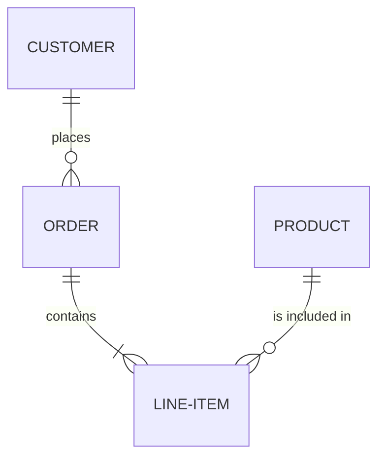
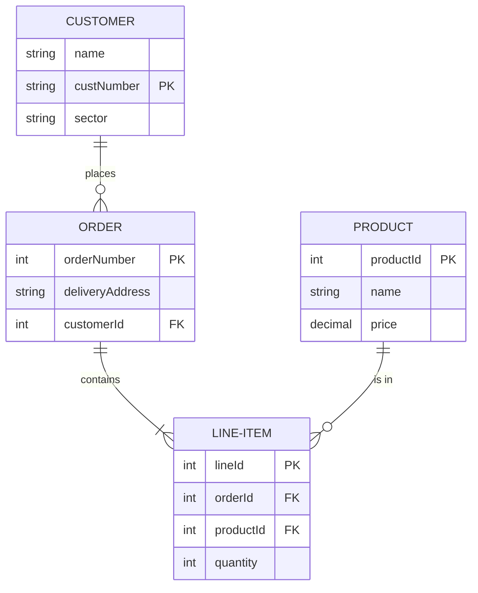
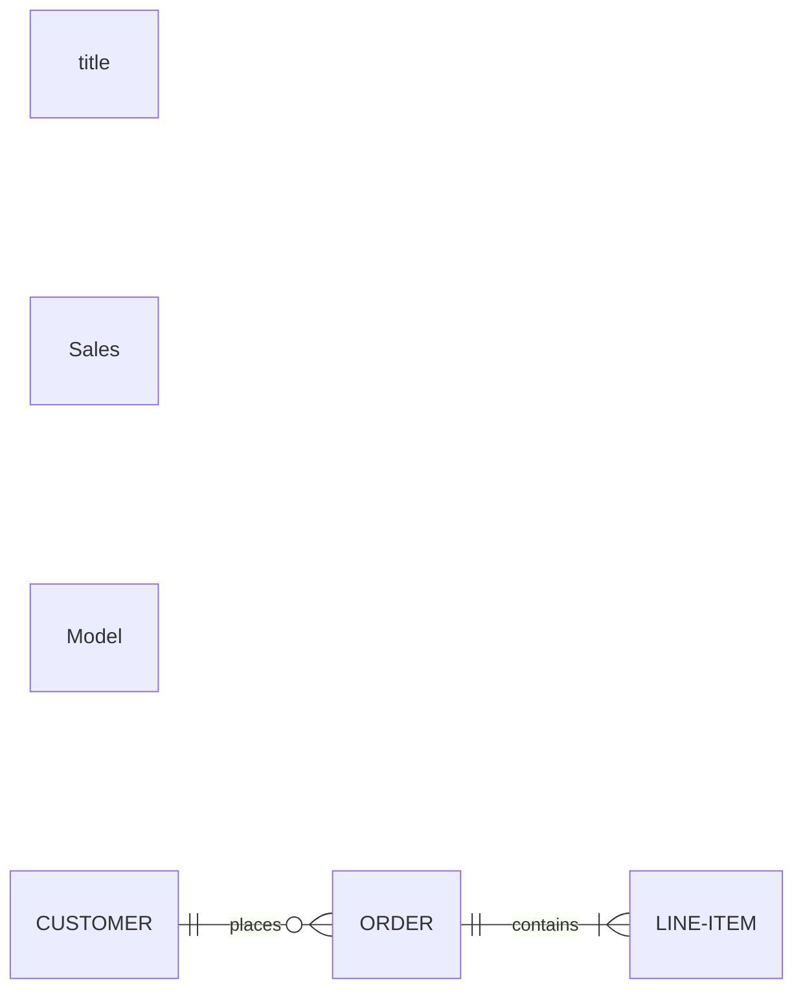
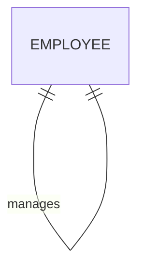
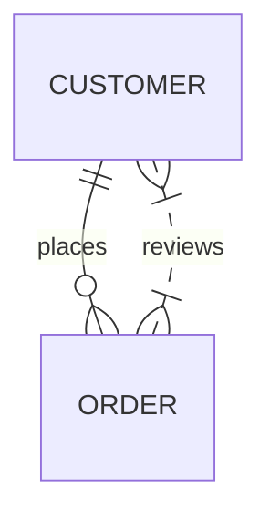
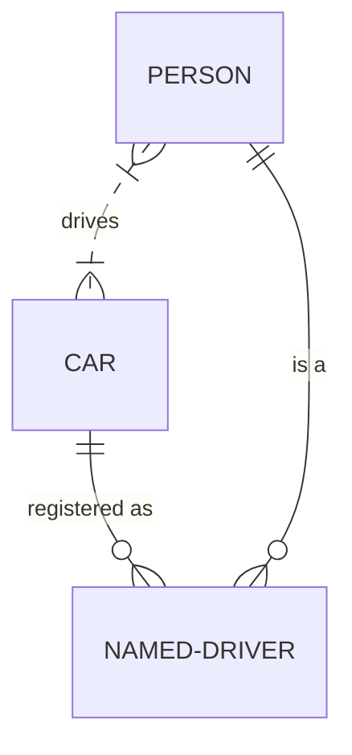
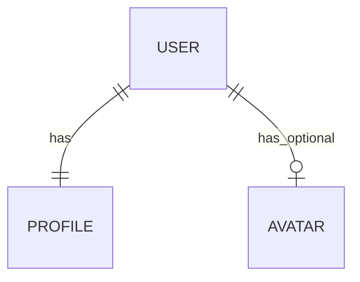

# ER Diagram Test

## Basic Relationships

## Entities with Attributes

## Direction and Title

## Self Relation

## Multiple Relations Between Same Entities

## Non-Identifying Relationships (Dashed Lines)

## Simple Entity Only

