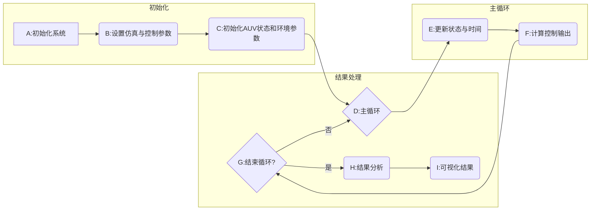
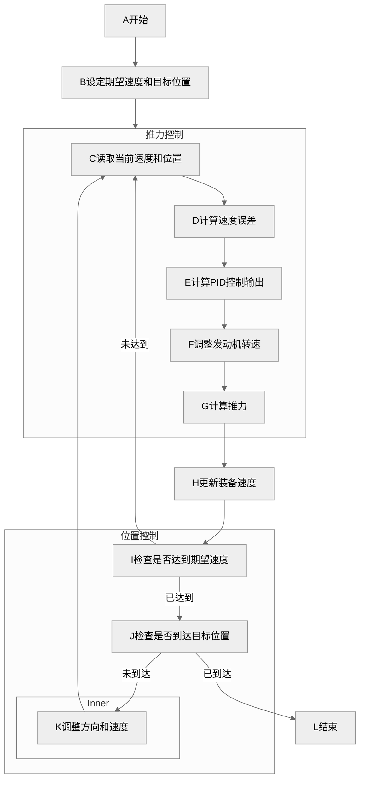
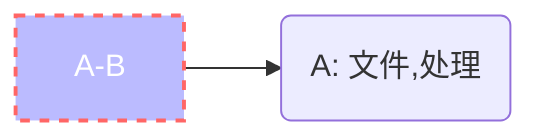
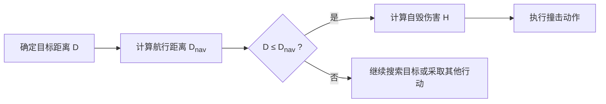
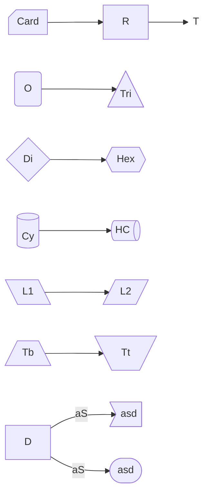

# Subgraph
```mermaid
---
title: 带文本的节点
---
%%{init: {'theme':'forest'}}%%
 graph LR   
    C
    --> 
    D[[D估算载荷分布]]    
    
    C --> SJ
    F[F遍历激光雷达数据点] --> G{G是否位于A/B段?}
    
    subgraph SJ ["实际扰度
              [计算]" 'calc']
       direction
       G -- 是 --> H[H计算对应位置的载荷 P]
             
       subgraph ad [" "]
        direction TB
       	G x-- LINK-=TEXT --> F
       end       
    end
```






## Comment

`````mermaid
%%{init: {"flowchart": {"htmlLabels": false}, 'theme':'dark'} }%%
graph RL
	%% this is a comment
    %%
    A%%
    
    %%
    -- Text1 ---
    A%%
    
    D""
    `` x==x E --> A%%
    
    A%% -->|Text2|D""
`````

# Edge and Shape

````mermaid
%%{init: {'theme':'base'}}%%
graph RL
    - -.-x D
    
    A ==o xD
    A-o--xD   
    
    Ax--xD
    Ax--text0
    -->
    A --"text1"
    text2
    --> E 
    
    D --> E{"`E{构建理想挠
    	曲线**模型**}`"}
    
    D[
    D:lonely
    ]
        
    : <-- to --> E ~~~~ F
`````


# AMP

```````mermaid
graph BT
    &A & B --> C
    C-->D
```````

# Style



# HTML



# Flowchart Shape Samples



