# Subgraph
```mermaid
---
title: Nodes with Text
---
%%{init: {'theme':'forest'}}%%
 graph LR   
    C
    --> 
    D[[D Estimate Load Distribution]]
    
    C --> SJ
    F[F Iterate Lidar Data Points] --> G{G Is in A/B Section?}
    
    subgraph SJ ["Actual Deflection
              [Calculation]" 'calc']
       direction
       G -- Yes --> H[H Calculate Load P at Corresponding Position]
             
       subgraph ad [" "]
        direction TB
       	G x-- LINK-=TEXT --> F
       end       
    end
```


## Comment

`````mermaid
%%{init: {"flowchart": {"htmlLabels": false}, 'theme':'dark'} }%%
graph RL
	%% this is a comment
    %%
    A%%
    
    %%
    -- Text1 ---
    A%%
    
    D""
    `` x==x E --> A%%
    
    A%% -->|Text2|D""
`````

# Edge and Shape

````mermaid
%%{init: {'theme':'base'}}%%
graph RL
    - -.-x D
    
    A ==o xD
    A-o--xD   
    
    Ax--xD
    Ax--text0
    -->
    A --"text1"
    text2
    --> E 
    
    D --> E{"`E{Construct Ideal Deflection
	Curve **Model**}`"}
    
    D[
    D:lonely
    ]
        
    : <-- to --> E ~~~~ F
`````


# AMP

```````mermaid
graph BT
    &A & B --> C
    C-->D
```````

# Style


# HTML

```mermaid
graph LR
    A[Determine Target Distance D] --> B[Calculate Navigation Distance D<sub>nav</sub>]
    B --> C{D ≤ D<sub>nav</sub> ?}
    C -->|Yes| D[Calculate Self-Destruct Damage H]
    D --> E[Execute Impact Action]
    C -->|No| F[Continue Searching for Target or Take Other Actions]
```



# Flowchart Shape Samples


