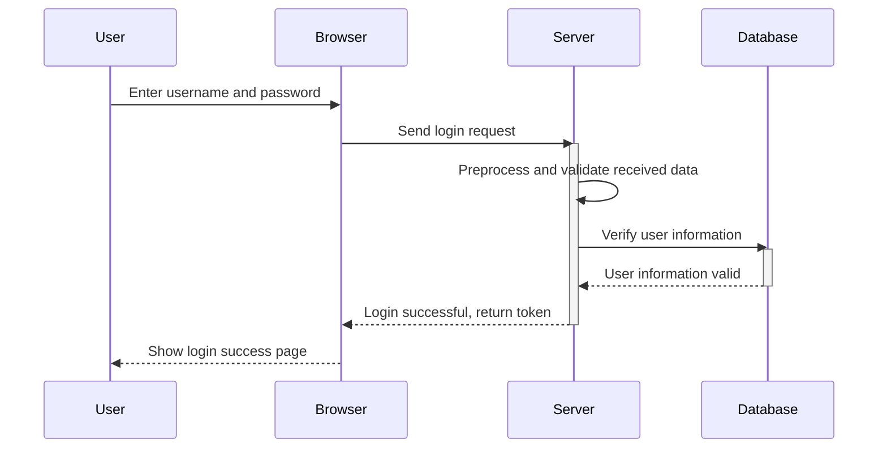
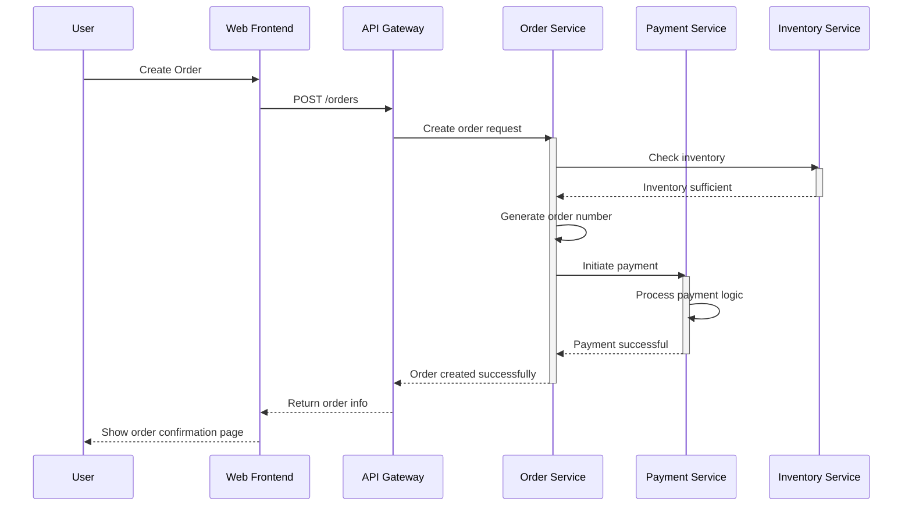
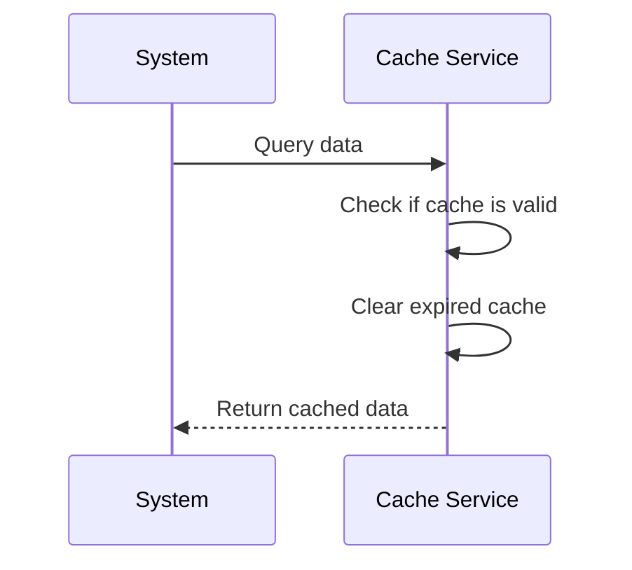
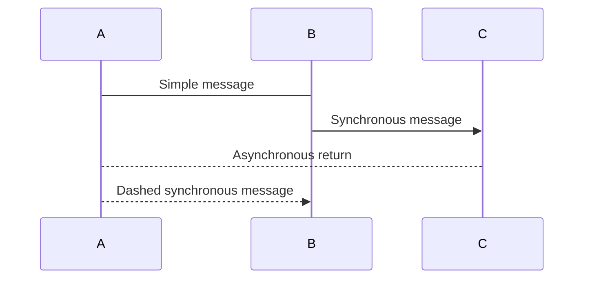
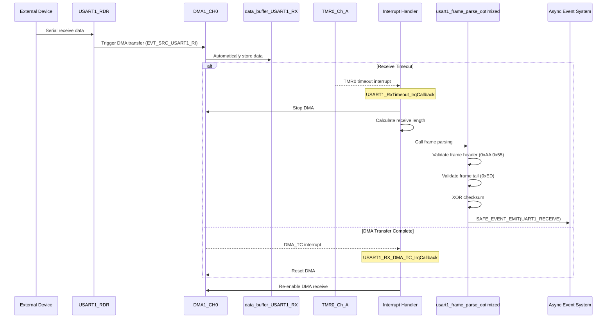

# Sequence Diagram Test

## Basic Sequence Diagram - User Login Flow

## Complex Sequence Diagram - Order Processing Flow

## Self-call Test

## Simple Message Type Test

## Fragment and Note Test - Receive Timeout Handling

