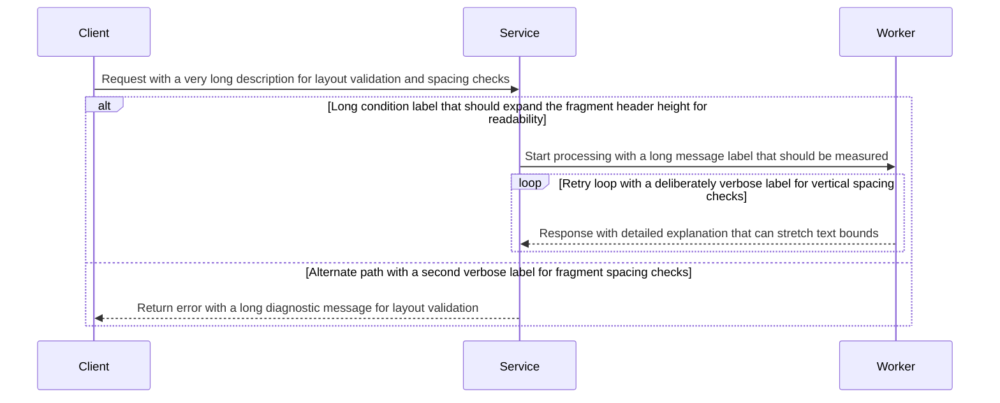

# Sequence layout validation - fragments and long labels

## Fragment + long label sample

```mermaid
sequenceDiagram
    participant Client
    participant Service
    participant Worker

    Client->>Service: Request with a very long description for layout validation and spacing checks
    alt Long condition label that should expand the fragment header height for readability
        Service->>Worker: Start processing with a long message label that should be measured
        loop Retry loop with a deliberately verbose label for vertical spacing checks
            Worker-->>Service: Response with detailed explanation that can stretch text bounds
        end
    else Alternate path with a second verbose label for fragment spacing checks
        Service-->>Client: Return error with a long diagnostic message for layout validation
    end
```
