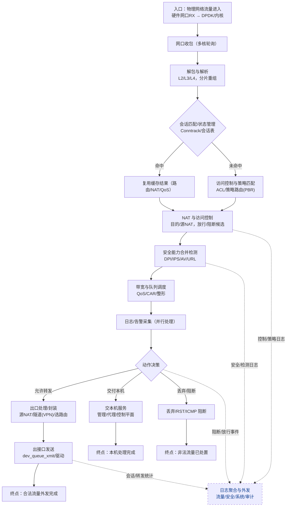

```mermaid
flowchart TB
%% 起点/终点
Start["入口：物理网络流量进入<br/>硬件网口RX → DPDK/内核"] --> RX["网口收包（多核轮询）"]
RX --> Parse["解包与解析<br/>L2/L3/L4，分片重组"]
Parse --> Sess{"会话匹配/状态管理<br/>Conntrack/会话表"}
Sess -- "命中" --> Fast["复用缓存结果（路由/NAT/QoS）"]
Sess -- "未命中" --> Policy["访问控制与策略匹配<br/>ACL/策略路由(PBR)"]
Fast --> NatAcl
Policy --> NatAcl

NatAcl["NAT 与访问控制<br/>目的/源NAT，放行/阻断候选"] --> Sec["安全能力合并检测<br/>DPI/IPS/AV/URL"]
Sec --> QoS["带宽与队列调度<br/>QoS/CAR/整形"]
QoS --> LogAlm["日志/告警采集（并行处理）"]
LogAlm --> Decide{"动作决策"}
Decide -- "允许转发" --> Post["出口处理/封装<br/>源NAT/隧道(VPN)/选路由"]
Decide -- "交付本机" --> Local["交本机服务<br/>管理/代理/控制平面"]
Decide -- "丢弃/阻断" --> Drop["丢弃/RST/ICMP 阻断"]

Post --> Xmit["出接口发送<br/>dev_queue_xmit/驱动"]
Xmit --> EndOk["终点：合法流量外发完成"]
Local --> EndLocal["终点：本机处理完成"]
Drop --> EndDrop["终点：非法流量已处置"]

%% 并行日志（虚线）
classDef log stroke-dasharray: 5 5, color:#0b3d91
Sec -. "安全/检测日志" .-> LogStore["日志聚合与外发<br/>流量/安全/系统/审计"]:::log
NatAcl -. "控制/策略日志" .-> LogStore
Decide -. "阻断/放行事件" .-> LogStore
Xmit -. "会话/转发统计" .-> LogStore


```