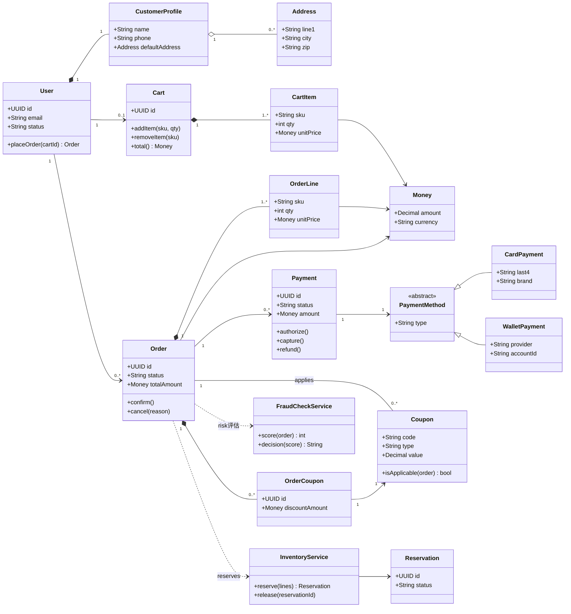

```mermaid
classDiagram
direction LR

class User {
  +UUID id
  +String email
  +String status
  +placeOrder(cartId) Order
}
class CustomerProfile {
  +String name
  +String phone
  +Address defaultAddress
}
class Address {
  +String line1
  +String city
  +String zip
}

class Cart {
  +UUID id
  +addItem(sku, qty)
  +removeItem(sku)
  +total() Money
}
class CartItem {
  +String sku
  +int qty
  +Money unitPrice
}
class Money {
  +Decimal amount
  +String currency
}

class Order {
  +UUID id
  +String status
  +Money totalAmount
  +confirm()
  +cancel(reason)
}
class OrderLine {
  +String sku
  +int qty
  +Money unitPrice
}

class Payment {
  +UUID id
  +String status
  +Money amount
  +authorize()
  +capture()
  +refund()
}
class PaymentMethod {
  <<abstract>>
  +String type
}
class CardPayment {
  +String last4
  +String brand
}
class WalletPayment {
  +String provider
  +String accountId
}

class Coupon {
  +String code
  +String type
  +Decimal value
  +isApplicable(order) bool
}
class OrderCoupon {
  +UUID id
  +Money discountAmount
}

class InventoryService {
  +reserve(lines) Reservation
  +release(reservationId)
}
class Reservation {
  +UUID id
  +String status
}
class FraudCheckService {
  +score(order) int
  +decision(score) String
}

User "1" *-- "1" CustomerProfile
CustomerProfile "1" o-- "0..*" Address

User "1" --> "0..1" Cart
Cart "1" *-- "1..*" CartItem
CartItem --> Money

User "1" --> "0..*" Order
Order "1" *-- "1..*" OrderLine
OrderLine --> Money
Order --> Money

Order "1" --> "0..*" Payment
Payment "1" --> "1" PaymentMethod
PaymentMethod <|-- CardPayment
PaymentMethod <|-- WalletPayment

Order "1" -- "0..*" Coupon : applies
Order "1" *-- "0..*" OrderCoupon
OrderCoupon "1" --> "1" Coupon

Order ..> InventoryService : reserves
InventoryService --> Reservation
Order ..> FraudCheckService : risk评估
```