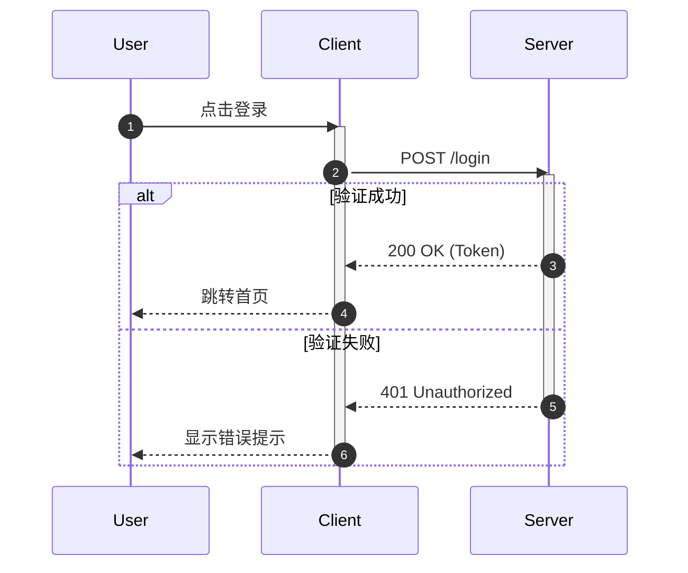

```mermaid
sequenceDiagram
    autonumber
    participant U as User
    participant C as Client
    participant S as Server
    
    U->>C: 点击登录
    activate C
    C->>S: POST /login
    activate S
    
    alt 验证成功
        S-->>C: 200 OK (Token)
        C-->>U: 跳转首页
    else 验证失败
        S-->>C: 401 Unauthorized
        deactivate S
        C-->>U: 显示错误提示
    end
    deactivate C


```
